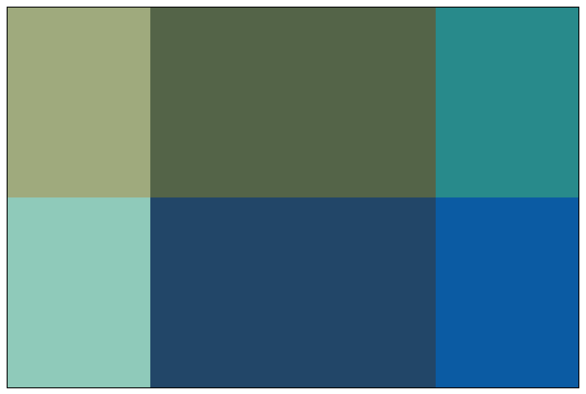

注意，这篇文章只是我自己在学习 CSS Grid 布局过程中的一些笔记。更加完整的指南请参考 [MDN 的文档](https://developer.mozilla.org/en-US/docs/Web/CSS/CSS_grid_layout)或者[CSS-TRICKS 的这篇文章](https://css-tricks.com/snippets/css/complete-guide-grid/)。

## 基础例子

html：

```html
<div class="container">
  <div class="box box-1"></div>
  <div class="box box-2"></div>
  <div class="box box-3"></div>
  <div class="box box-4"></div>
  <div class="box box-5"></div>
  <div class="box box-6"></div>
</div>
```

css:

```css
.box {
  color: white;
  text-align: center;
}

.box-1 {
  background-color: #A9B388;
  grid-area: box-1;
}
.box-2 {
  background-color: #5F6F52;
  grid-area: box-2;
}
.box-3 {
  background-color: #2D9596;
  grid-area: box-3;
}
.box-4 {
  background-color: #9AD0C2;
  grid-area: box-4;
}
.box-5 {
  background-color: #265073;
  grid-area: box-5;
}
.box-6 {
  background-color: #0766AD;
  grid-area: box-6;
}

.container {
  border: 1px solid;
  width: 600px;
  height: 400px;

  display: grid;
  grid-template-columns: 1fr 50% 1fr;
  grid-template-rows: repeat(2, 1fr);
  grid-template-areas:
    'box-1 box-2 box-3'
    'box-4 box-5 box-6';
}
```

效果：



在这里，给 `div.container` 设置了 `diaplay: grid;` 属性之后，`div.container` 就会变成一个 grid container，它的所有**直接**子元素都是一个 grid item。

对于每一个 grid item，可以用 `grid-area` 属性取一个名字。在 grid container 的 `grid-template-areas` 属性中可以用这个名字应用到对应的 grid item。

可以看出来，Grid 布局实际上是把一个区域划分成一个一个的“小格子”，或者叫“grid cell”。

## 合并多个 grid cell

利用 `grid-template-areas` 属性可以合并多个 grid cell。例如把左边两个 grid cell 合并成一个：

```css
.container {
  ...
  grid-template-areas:
    'box-1 box-2 box-3'
    'box-1 box-5 box-6'; /* 把 box-4 改成 box-1 */
}
```

这样就可以让 box-1 同时占据左边的两个 grid cell。效果：


我们发现，box-1 占据了原本属于 box-4 的位置，那 box-4 这个元素去哪里了？可以在 `div.box-4` 这个元素里加一些内容看看：

```html
<div class="container">
	...
  <div class="box box-4">box-4</div>
  ...
</div>
```


可以看到 box-4 被挤到了 grid container 的右下角。之前没有看到只是因为 box-4 没有内容，也没有显示地设置宽高。事实上，没有出现在 `grid-template-areas` 属性里的 grid item 都会被挤到 grid container 的右下角，而且是沿着 z 轴堆叠起来，而不是按照文档流排列。

### 搞一下破坏

虽然一般情况下你不会这样做，但我们还是可以写一些奇怪的配置。

例如你把 `grid-template-areas` 改成这样：

```css
.container {
  ...
  grid-template-areas:
    'box-1 box-1 box-3'  /* 注意这里有两个 box-1 */
    'box-1 box-5 box-6'; /* 这里也有一个 box-1 */
}
```

就会发现所有的 grid item 都不见了（其实正如上面说的，只是被挤到了右下角）。并且用浏览器开发者工具的 Styles 面板去观察此时的 `grid-template-areas` ，发现它的值其实是不合法的，也就等于没有设置 `grid-template-areas`。简单来说就是同一个 grid-area 不能同时出现在横向和纵向排列中，除非 `grid-template-areas` 里面只出现同一个 grid item，这时候就变成用同一个 grid item 铺满一整个 grid container。

```css
.container {
  ...
  grid-template-areas:
    'box-1 box-1 box-1'
    'box-1 box-1 box-1';
}
```

## 加一些间隔

假设我们希望在每一列之间加一个 10px 宽的空白间隔，有以下几种方式。

### grid-template

第一种做法是在 `grid-template-areas` 中每一行的每两个 grid-area 之间加一个“.”，同时还需要在 `grid-template-columns` 中相应的位置加上期望的间距值，在这里就是 10px。

```css
.container {
	...
  grid-template-columns: 1fr 10px 50% 10px 1fr; /* 这里多了两个 10px */
	...
  grid-template-areas:
    'box-1 . box-2 . box-3'  /* 这里每两个 grid-area 之间多了一个 . */
    'box-4 . box-5 . box-6';
}
```


### grid-column-gap

上面的方法需要同时改动 `grid-template-areas` 和 `grid-template-columns` 两个属性，有点麻烦。用 `grid-column-gap` 只需要一行代码就能实现同样的效果：

```css
.container {
	...
  grid-column-gap: 10px;
}
```

### 非正常的做法

上面两种都是添加间距的正常方法，当然也有“不那么正常”的做法。直接把 `grid-template-areas` 中的某一个 grid area 换成 "." ，对应的区域就会变成空白：

```css
.container {
  ...
  grid-template-areas:
    'box-1 . box-3'			/* 这里的 box-2 变成了 . */
    'box-4 . box-6'; 		/* 这里的 box-5 变成了 . */
}
```


可以看到，box-2 和 box-5 都“消失”了，变成了空白。同样，“消失”的 grid item 只是被挤到了 grid container 的右下角。只要调整一下 `grid-template-columns` 的属性值，让中间的空白区域变小，看起来就会是一个正常的空白间距了。

但是这种方法会把某个 grid item 挤走，实际开发中可能会导致出现非期望中的结果。话虽如此，但也可以用这种方法来玩一些花样。例如实现一个跑马灯抽奖动画：


相关 js 代码：

```js
const container = document.querySelector('.container');
const list = [
	"'. box-2 box-3' 'box-4 box-5 box-6'",
	"'box-1 . box-3' 'box-4 box-5 box-6'",
	"'box-1 box-2 .' 'box-4 box-5 box-6'",
	"'box-1 box-2 box-3' 'box-4 box-5 .'",
	"'box-1 box-2 box-3' 'box-4 . box-6'",
	"'box-1 box-2 box-3' '. box-5 box-6'",
]
let i = 0

setInterval(() => {
	if (i === list.length) i = 0
	container.style.gridTemplateAreas = list[i++];
}, 300)
```


## 调整顺序

在不用 Grid 布局的时候，如果要调整几个子元素的顺序，一般需要修改 html 的节点顺序或者用 css 的定位。在 Grid 布局里，可以利用 `grid-template-areas` 来改变这些 grid item 的顺序：

```css
.container {
  ...
  grid-template-areas:
    'box-4 box-6 box-2'
    'box-1 box-3 box-5';
}
```


当然，再怎么随意排列也不能超出 `grid-template-areas` 的有效值范围。例如这样就是无效的：

```css
.container {
  ...
  grid-template-areas:
    'box-4 box-6 box-2 box-1'
    'box-3 box-5';
}
```

如果确实想要实现第一行有 4 个 grid item，第二行有两个 grid item 的效果，可以参考上面用 `grid-template` 设置间距的方法。

## 再说 grid-template

通过上面的例子可以发现，其实 `grid-template-areas` 的主要作用就是控制 grid item 的排列组合。即使不设置 `grid-template-areas` 的值，grid container 还是会根据 `grid-template-columns` 和 `grid-template-rows` 把自身的区域划分成多个区块。通过浏览器的开发者工具可以看出这一点：


我认为 `grid-template-areas` 属性值的语法是比较直观的。就是对着上面划分出来的区域把 grid-area 一个一个往里面填。至于每一个区域自身的内容要如何布局，就再用 Grid 的 `justify-items`、 `align-items` 等属性或者其他 css 的布局方式。用起来还是比较简单的。

## 总结

CSS Grid 布局的要点主要是两个：

1. 划分区域：利用 `grid-template-columns` 和 `grid-template-rows` 在 grid container 里划分多个区域（也叫 grid cell）；
2. 排兵布阵：通过 `grid-template-areas` 对各个 `grid-area` 进行排列组合、填充 grid cell。

只要掌握了这两点，就能把 Grid 布局用起来。

如果想对 Grid 中的元素进行更多控制，就要用到 `justify-items`、 `align-items` 等属性。不过如果已经熟悉 Flexbox 的话，想再掌握 Grid 中的这些属性就很容易了。

## 参考

- [A Complete Guide to CSS Grid](https://css-tricks.com/snippets/css/complete-guide-grid)

